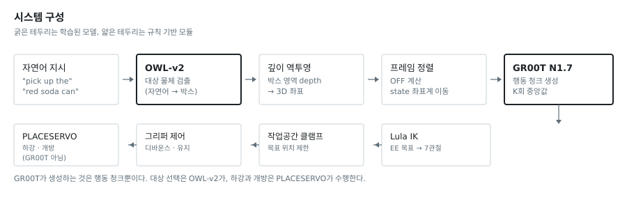
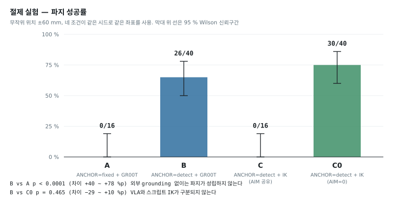
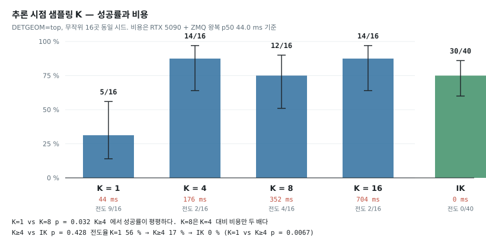
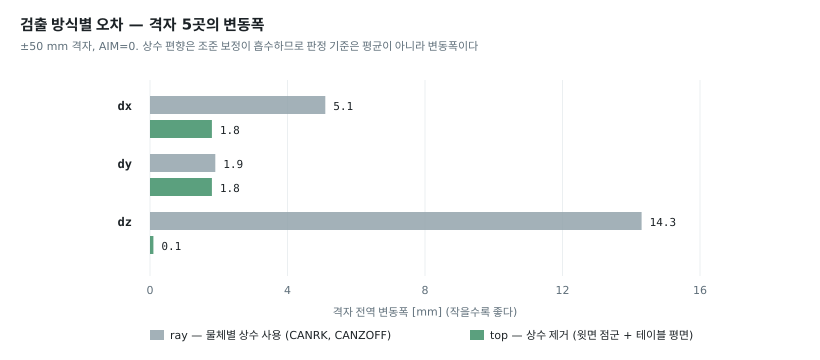

# GR00T N1.7 × Isaac Sim — 제로샷 파지 연동 및 절제 실험

Isaac Sim 6.0.1 환경에서 NVIDIA GR00T N1.7을 Franka Emika Panda에 연동하고,
그리퍼에 장착된 RGB-D 카메라 한 대만으로 물체를 집어 올리는 실험 환경이다.
**GR00T의 가중치는 학습시키지 않았다(제로샷).**

연동 자체보다 **각 구성요소가 실제로 무엇을 기여하는지를 분리 측정한 절제 실험**이
이 저장소의 내용이다. 결과는 두 방향으로 나뉜다.

| | 측정 결과 |
|---|---|
| **외부 grounding은 필수다** | 외부 물체 검출 없이 GR00T 단독으로는 0/16 (0 %). 검출을 붙이면 26/40 (65 %). Fisher 정확검정 p < 0.0001 |
| **VLA의 기여는 확인되지 않는다** | 동일 검출·동일 보정 아래 행동 생성만 스크립트 IK로 바꾸면 30/40 (75 %). p = 0.465, 차이 −29 ~ +10 %p |

두 번째가 이 저장소의 주된 결과이며, 음성 결과다.

---

## 1. 시스템 구성



| 모듈 | 종류 | 역할 |
|---|---|---|
| OWL-v2 | VLM 검출기 | 자연어로 대상 물체 지목 |
| `can_detect.py` | 자체 코드 | 박스 영역 depth 역투영 → 물체 3D 좌표 |
| 프레임 정렬 | 자체 코드 | 추정 좌표로 정책이 보는 상태 좌표계를 이동 |
| GR00T N1.7 | VLA (3B) | 행동 청크 생성 |
| Lula IK | 운동학 솔버 | End-Effector 목표 → 7관절 각도 |
| PLACESERVO | 자체 폐루프 서보 | 하강 및 개방 |

### 정확히 하기 위해 밝혀두는 것

- **대상 선택은 OWL-v2가 한다.** GR00T에 주는 지시문은 대상 선택에 관여하지 않는다.
- **하강과 개방은 GR00T가 하지 않는다.** PLACESERVO가 수행한다.
- **회전 3-DoF는 사용하지 않는다.** `chunk[:,3:6]=0`, `target_q=q0`.
  그 근거는 [docs/RESULTS.md §5](docs/RESULTS.md#5-회전-3-dof-rot6)에 있다.
- **씬은 LIBERO도 SimplerEnv도 아니다.** 자체 제작 Isaac Sim 씬이다.

---

## 2. 절제 실험

네 조건은 **정책·앵커·조준 보정 외에는 전부 동일**하다. 무작위 좌표도 같은 시드에서
생성되어 네 조건이 같은 위치를 본다.

| 조건 | 앵커 | 행동 생성 | 조준 보정 |
|---|---|---|---|
| A | `fixed` (외부 grounding 없음) | GR00T | 공유 |
| B | `detect` | GR00T | 공유 |
| C | `detect` | 스크립트 IK | 공유 |
| C0 | `detect` | 스크립트 IK | 0 |



C와 C0의 차이는 조준 보정값 하나뿐이다. 이 값은 GR00T가 학습 데이터에서 얻은
궤적 편향을 상쇄하기 위한 것이므로, GR00T가 없는 조건에 그대로 적용하면
목표점이 41.6 mm 어긋난다. C0가 정직한 비교 대상이다.

전체 수치와 검정 결과는 [docs/RESULTS.md](docs/RESULTS.md)에 있다.

---

## 3. 추론 시점 샘플링

GR00T의 액션 헤드는 확률적이다. 동일 관측으로 반복 호출하면 매번 다른 행동이
나온다. 이에 대응해 동일 관측에서 K회 호출한 뒤 중앙값을 사용한다.



- K = 1에서 성공률이 무너지고 물체 전도율이 56 %로 상승한다.
- K ≥ 4에서 성공률이 평평하다. **K = 8은 K = 4 대비 비용만 두 배다.**
- 어느 K에서도 스크립트 IK와 유의한 차이가 없다.

정책 호출 1회의 왕복 지연은 RTX 5090에서 p50 44.0 ms, p99 48.5 ms이다.
K = 8이면 정책 스텝 1회가 352 ms이며 최대 정책 주기는 2.8 Hz다.
스크립트 IK의 추론 비용은 0이다.

---

## 4. 물체 상수 제거

초기 구현은 물체별 상수 두 개(`CANRK`, `CANZOFF`)를 시뮬레이터의 참 좌표와
비교해 교정했다. 이 방식은 실물에 이식할 수 없고, 절제 실험 결과의 해석에도
약점이 된다.

`DETGEOM=top`은 마스크 영역의 윗면 점군 중앙값으로 물체의 수직축을,
마스크 바깥 고리의 depth로 테이블 높이를 잡아 물체 상수를 제거한다.



평균 오차는 `top`이 크지만 그 편향은 위치와 무관하게 일정하므로 조준 보정이
흡수한다. 흡수 후 남는 것은 변동폭이며 세 축 모두 `top`이 작다.
파지 성공률은 두 방식이 구분되지 않는다(p = 0.542).

---

## 5. 실행

### 서버 두 개

```bash
# 정책 서버
cd <work>
nohup bash srv.sh > srv.log 2>&1 &

# 자연어 검출 서버
cd <isaac-gr00t>
DETMODEL=google/owlv2-base-patch16-ensemble uv run python <work>/det_server.py
```

### 파지 한 판

```bash
cd <work>
NOWIN=1 LIVE=0 PLACE=0 bash pick3.sh can 1
```

### 절제 실험

```bash
bash abc_eval2.sh setup
bash abc_eval2.sh B 16
bash abc_eval2.sh C0 16
bash abc_eval2.sh A 16
bash abc_eval2.sh C 16
bash abc_eval2.sh report
```

### 정책 호출 지연

```bash
python3 polat.py
```

---

## 6. 환경

| 항목 | 값 |
|---|---|
| 시뮬레이터 | Isaac Sim 6.0.1 |
| GPU / OS | RTX 5090 × 2, Ubuntu 24.04, 드라이버 575.57.08, CUDA 12.8 |
| 로봇 | Franka Emika Panda + Lula IK (`ee_frame=panda_hand`) |
| 센서 | Intel RealSense D405 (그리퍼 장착), 1280 × 720, RGB + Depth |
| VLA | `nvidia/GR00T-N1.7-LIBERO`, `libero_object` 서브셋, ZMQ `:5555` |
| 검출기 | `google/owlv2-base-patch16-ensemble`, ZMQ `:5556` |
| 대상 물체 | 콜라캔 (절제 실험은 이 물체로 한정) |

---

## 7. 문서

| 문서 | 내용 |
|---|---|
| [docs/RESULTS.md](docs/RESULTS.md) | 전체 측정 결과, 검정, 한계 |
| [docs/PROTOCOL.md](docs/PROTOCOL.md) | ZMQ 관측·행동 스키마, 좌표계, 그리퍼 규약 |
| [docs/CODEMAP.md](docs/CODEMAP.md) | 파일 목록과 역할 |
| [docs/MEDIA.md](docs/MEDIA.md) | 영상·이미지 자료의 출처와 배치 |

---

## 8. 범위와 한계

이 결과는 **정지한 단일 물체를 알려진 자세로 집는 태스크**에 한정된다.
검출 오차가 밀리미터 수준이고 물체가 움직이지 않는 조건에서는 시각 서보가
필요하지 않으며, 그 사실이 측정된 것이다. 이동 물체, 가림, 다단계 조작,
미지 물체에는 적용되지 않는다.

그 밖의 미완성 항목과 남은 반론은 [docs/RESULTS.md §7](docs/RESULTS.md#7-한계와-미완성-항목)에 정리했다.

---

## 9. 귀속

- GR00T N1.7 체크포인트: NVIDIA (`nvidia/GR00T-N1.7-LIBERO`)
- OWL-v2: Google (`google/owlv2-base-patch16-ensemble`)
- Isaac Sim 씬 정의 파일은 이 저장소에 포함하지 않는다.
